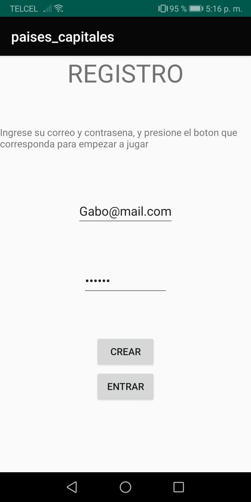
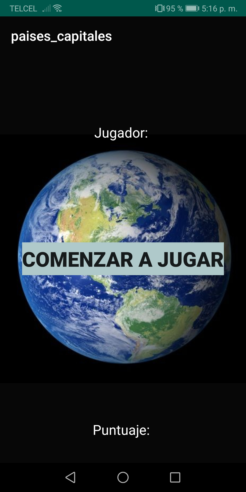
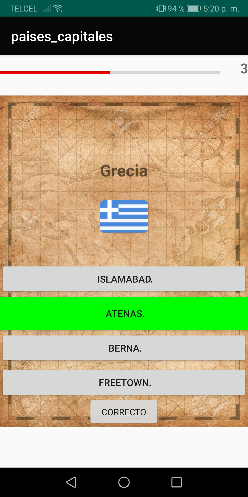
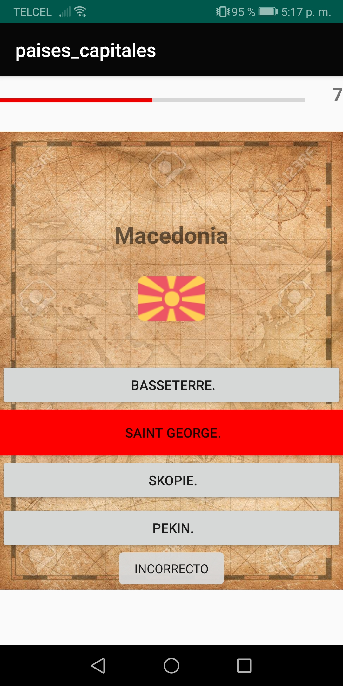
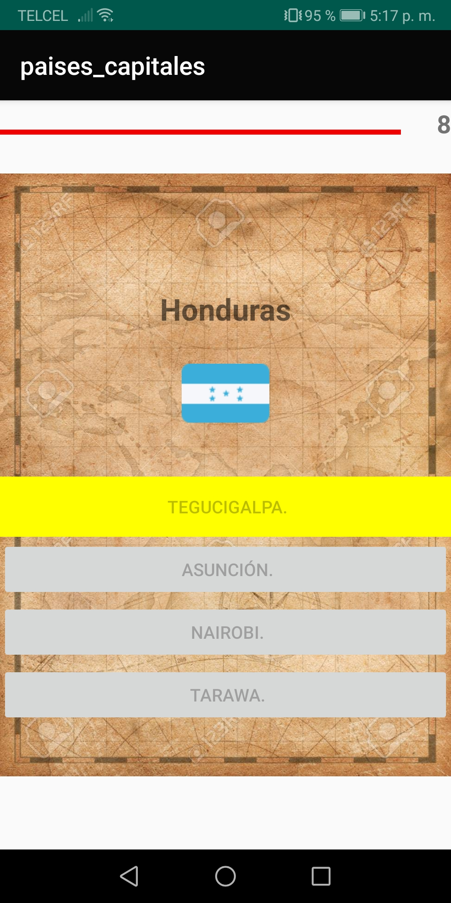
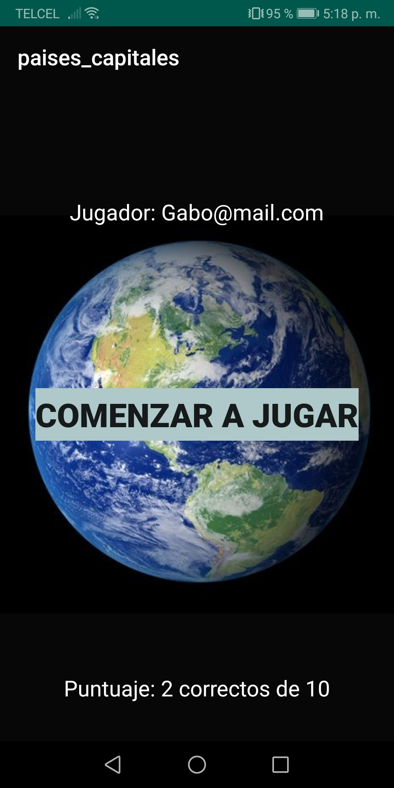
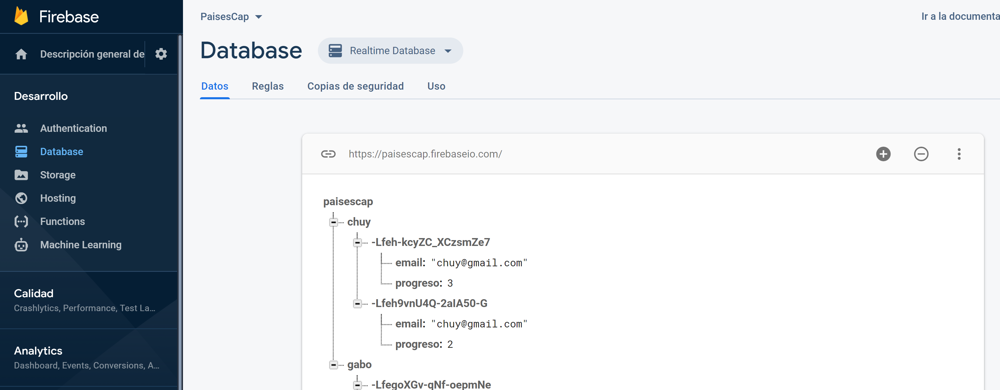

# Countries-and-Capitals-App-
### This is an Android app to learn the countries and capitals of the world.
Built in Android Studio with a connection to firebase to save user progress.

 
First you register or if you already have an account then just log in.  
This user will be saved in the firebase database
 

 

 
When the game starts, there is a bar that measures the time for you to choose an option, the limit is 10 seconds. 
If you choose the correct option, the button will turn green, red for wrong and yellow when 10 seconds are up.
 

 

 

 
When the game ends, the score obtained from the user appears and is saved in the database (firebase).
 

 
This is a screenshot of the data saved in firebase  

